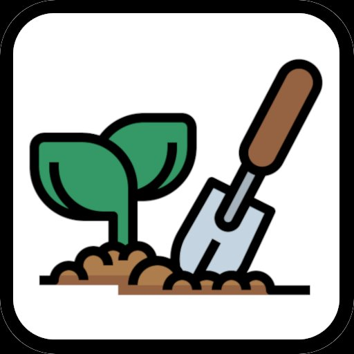

# 🌱 Garden Makeover v2 — Interactive 3D Playable Ad

> A mobile-first interactive 3D garden game built as a **playable ad** demo. Place crops and animals, manage your coins, skip to night — all in a polished WebGL experience running entirely in the browser.

<p align="center">
  
</p>

---

## 🎮 What is it?

**Garden Makeover v2** is a fully playable mini-game built with **Three.js** (3D) and **Pixi.js** (ALL UI, 2D FX), designed as a high-quality playable advertisement for mobile and desktop. It showcases real-time 3D rendering, cinematic state transitions, and responsive touch-friendly UI — all in a single self-contained web app.

---

## ✨ Features

### 🌍 3D Scene
- Full **WebGL scene** rendered with Three.js (r158)
- GLTF/GLB assets with **PBR materials** and real-time shadows (`PCFSoftShadowMap`)
- **Directional sun** with shadow casting, ambient fill light and fog
- **OrbitControls** for camera interaction (pan, zoom, rotate)
- Smooth **cinematic camera transitions** between tutorial steps
- Low-poly styled terrain (`ground.glb`) and object library (`objects.glb`)

### 🌱 Dual Placement Zones
- **Crop field** (8×7 grid) — place corn, grapes, strawberries and tomatoes
- **Animal pen** (2×3 fence grid) — place chickens, cows and sheep
- **Ghost preview** of items before confirming placement
- **Bounds validation** — prevents placing animals outside the pen with a toast warning
- Animated **floating `+` sprites** (custom texture) to guide the player to each zone
- Zone hints auto-hide permanently once used

### 🐄 Animals & 🌽 Crops
- All objects use **SkinnedMesh with animations** (`SkeletonUtils.clone` for correct bone binding)
- Idle and action animation states per item
- Items are placed at the correct **ground Y position** using per-item `feetY` offsets
- Costs deducted from coin balance on placement

### 💰 Economy System
- Coin counter HUD (top-right) with money icon
- Each item has a **cost** — can't place if insufficient funds
- **Upgrade modal** appears when a zone is full — prompts the player to expand

### 🎬 Tutorial System
- Multi-step cinematic tutorial with **animated camera pans**
- **3D sheep guide character** rendered in first-person HUD space (follows camera each frame using manual world-space positioning)
- Speech bubble popup with step-by-step instructions
- Responsive tutorial cameras: **landscape and portrait** variants
- Skip button to jump straight to gameplay

### 🌙 Day → Night Transition
- **`DayNightTransition`** class in `src/lighting/`
- Triggered by the **Skip Day button** (shown after first placement)
- Animates over 2.2 seconds using `smoothstep` easing:
  - Ambient light color & intensity
  - Sun color, intensity & arc position (sweeps across the sky)
  - Fill light fade
  - Sky background color
  - Fog color, near & far distances
  - Renderer tone-mapping exposure

### 🎆 Visual Effects
- **Smoke puff FX** on item placement using Pixi.js sprites (`smoke.png`)
  - 6 puffs burst upward, grow and fade with rotation
  - Texture preloaded at init to avoid lag
- Pixi.js canvas overlay (`z-index: 45`, pointer-events none) for 2D FX on top of WebGL

### 🖼️ UI & HUD (PIXI)
- **Coin HUD** (top-right) with animated money icon
- **Category sidebar** with crop / animal tabs and item submenus
- **Skip Day button** with pulsing glow animation, appears after first placement
- **Watermark logo** (top-left, always visible, semi-transparent)
- **Toast notifications** for errors and hints
- **Custom cursor** (`hand-pointer.png`, black background removed)
- Upgrade modal with glassmorphism styling

### 📱 Responsive Layout
- Fully responsive for **portrait and landscape** on mobile
- Portrait mode: sidebar moves to bottom-left horizontal row, labels hidden, submenu opens upward
- Adaptive icon sizes using `clamp()` CSS functions
- Separate portrait camera configurations pulled back for wider field of view
- `user-scalable=no` viewport to prevent accidental zoom on mobile

### 🔊 Audio
- Background music loop (`theme.mp3`)
- Per-animal sound FX: chicken, cow, sheep
- UI click and popup sounds
- Web Audio API via a custom `AudioManager`

---

## 🏗️ Architecture

```
src/
├── core/
│   ├── Game.ts              # Main game loop, state machine
│   └── GameConfig.ts        # Centralized config (grid sizes, colors, asset paths…)
├── managers/
│   ├── AssetManager.ts      # GLTF + texture preloading
│   ├── SceneManager.ts      # Three.js scene, camera, renderer, lights
│   ├── AudioManager.ts      # Web Audio wrapper
│   └── UIManager.ts         # All PIXI UI: HUD, sidebar, modals, FX
├── garden/
│   ├── GardenGrid.ts        # Grid logic for field and fence zones
│   ├── ItemCatalog.ts       # Item definitions (crops + animals)
│   ├── ZoneHints.ts         # Floating + sprites guiding placement
│   └── GhostItem.ts         # Semi-transparent placement preview
├── lighting/
│   └── DayNightTransition.ts # Animated day→night scene transition
├── states/
│   ├── GameState.ts         # Base state interface
│   ├── LoadingState.ts      # Asset preload + progress bar
│   ├── TutorialState.ts     # Cinematic intro with 3D sheep guide
│   └── PlayState.ts         # Main gameplay loop
└── utils/
    └── EventEmitter.ts      # Typed event bus
```

---

## 🚀 Getting Started

### Prerequisites
- Node.js 18+

### Install & Run

```bash
# Unzip the project
unzip garden-makeover.zip -d garden-makeover
cd garden-makeover

# Install dependencies
npm install

# Start dev server
npm run dev
# → http://localhost:3000

# Production build
npm run build
```

---

## 🛠️ Tech Stack

| Tech | Version | Purpose |
|------|---------|---------|
| [Three.js](https://threejs.org) | r158 | 3D WebGL rendering |
| [Pixi.js](https://pixijs.com) | 7.4.3 | 2D sprite effects overlay |
| [Vite](https://vitejs.dev) | 5 | Dev server & bundler |
| [TypeScript](https://www.typescriptlang.org) | 5.3 | Type safety |

---

## 📁 Assets

| File | Purpose |
|------|---------|
| `ground.glb` | Terrain mesh with fence pen |
| `objects.glb` | All crops and animals (SkinnedMesh + animations) |
| `icon.png` | App logo / watermark |
| `smoke.png` | Placement FX particle |
| `plus.png` | Zone hint sprites (3D billboards) |
| `skip_day.png` | Skip Day button icon |
| `money.png` | Coin HUD icon |
| `hand-pointer.png` | Custom cursor |
| `chicken/cow/sheep.png` | Animal sidebar icons |
| `corn/grape/strawberry/tomato.png` | Crop sidebar icons |

---

## 📐 Grid Configuration

| Zone | Cols | Rows | Cell size | World offset |
|------|------|------|-----------|-------------|
| Crop field | 8 | 7 | 2.2u | X: -13, Z: -8 |
| Animal pen | 2 | 3 | 1.6u | X: 7.4, Z: -10.2 |

Grid Y ground plane: **4.05**